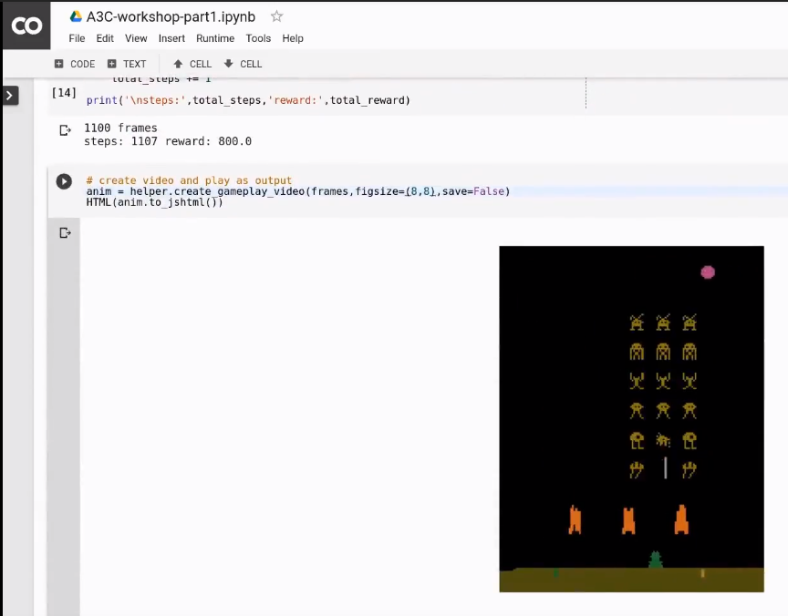

# Reinforcement Learning 101

<a href="https://www.youtube.com/watch?v=e5VhebMbvuk">

<a/>

This is a self-contained laboratory session, of a Reinforcement Learning model (A3C) playing [Atari Space Invaders](https://gym.openai.com/envs/SpaceInvaders-v0/).

These Python based notebooks are designed to work inside Google's free research and education tool [Colaboratory](https://colab.research.google.com),  which requires only a Google account. Check out their [FAQ](https://research.google.com/colaboratory/faq.html).

The human interface to the underlying [Tensorflow](https://www.tensorflow.org/) machine learning framework is the [Jupyter Notebook](http://jupyter.org/) environment, (which opens `*.ipynb` files).

---

#### Documented Notebooks:
1. `A3C_workshop-part_1.ipynb` will load a model from a checkpoint, then run and display a game being played
    - the documentation will teach the NN structure and RL basics (eg. environments, agents, rewards)
    
2. `A3C_workshop-part_2.ipynb` will train a model, saving checkpoints and logging to tensorboard
    - the documentation will teach how updating the model works and more about RL
    - training on Colaboratory isn't recommended
        - the model checkpoints can be difficult to download as the files might be too large
        - the VM stops after 12 hours

3. `A3C_Definitions.ipynb` will show definitions and meanings of terms frequently used in the first two notebooks
   
### Instructions for running:

**1. Download or clone this repository then upload the folder to your Google Drive**

  - if you downloaded the ZIP, extract it on your local machine first and rename the folder to the name of this repo

**2. Copy [this](https://drive.google.com/drive/folders/1-MoPlNCasBnr7SPLSL22g26YPQHE1UUR?usp=sharing) folder into your Google Drive `Reinforcement_Learning-101-demo/logdir/`**

  - Your `logdir/` should now contain a folder similar to `run_01-lr_0.0001-nw_24-tmax_50/`

**3. From Drive, open a notebook file with Colaboratory**

  - Double-click some `*.ipynb` file, then choose _Connected Apps - Colaboratory_

  - If Colaboratory is not shown, you'll have to first add it from _Open With_, then search _Colab_, then connect. Choose https://colab.research.google.com

**4. From Colab, select runtime, change runtime type, and set hardware accelerator to GPU**

  - If it won't allocate one, that's fine (it'll just be a bit slower)
  
  - if you are using the GPU, it may well run out of GPU memory, so you'll have to change back to CPU

---

### Contributions

Contributions are welcome, I particularly appreciate corrections from PR's or raised through _Issues_. Please make an individual PR for each suggestion.

Stack Overflow would be the best place for help with using the frameworks.

---

Licence: Apache 2.0.  © 2018 Kiran Arun
